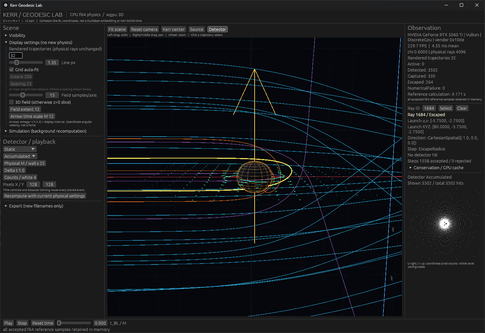
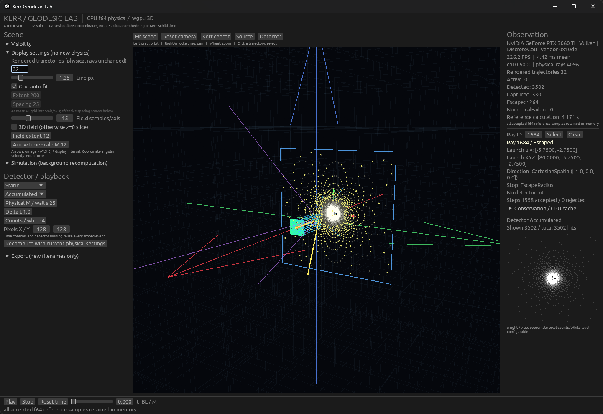

# 빛에 남은 흔적으로 회전하는 중력장 읽기

  

  

# 3차원 수치 시뮬레이션을 이용한 회전정보 추정

회전하는 질량 주위에서는 시공간 자체가 회전의 영향을 받으며, 그 안을 지나는 빛의 경로와 최종 검출 결과도 달라진다.

이 연구의 핵심 질문은 다음과 같다.

**회전하는 Kerr 중력장을 통과한 뒤 검출된 빛만으로 원래 중력장의 회전량을 알아낼 수 있는가?**

이를 조사하기 위해 Kerr 회전량과 초기 광선 조건을 지정하여 검출 결과를 계산하는 forward simulation을 구축하였다. 이 시뮬레이션으로 생성한 데이터를 바탕으로, 검출된 빛에서 회전량을 추정하는 역문제(inverse problem)를 분석할 계획이다.

## 1. Kerr 시공간과 빛의 모델

회전하는 중력장은 Kerr 시공간(Kerr spacetime)으로 모델링한다. 회전량은 무차원 Kerr spin parameter

$$
\chi = \frac{a}{M}
$$

으로 나타내며, 계산에는 기하단위계

$$
G = c = M = 1
$$

을 사용한다.

현재 사용하는 회전량 범위는

$$
-0.999 \leq \chi \leq +0.999
$$

이다. 양수와 음수의 $\chi$를 모두 포함하여 회전량의 크기와 회전 방향에 따른 차이를 함께 다룬다.

빛의 에너지가 중력원의 질량 에너지에 비해 충분히 작다는 가정 아래, Kerr 시공간을 고정된 배경으로 취급한다. 광선의 경로, 포획 여부, 검출 위치와 도착시간을 계산하기 위해 기하광학 근사(geometrical-optics approximation)를 적용하고, 빛의 운동을 Kerr 시공간의 영측지선(null geodesic)으로 추적한다.

## 2. 3차원 광선 시뮬레이션과 검출면

광선의 초기조건은 중력원을 원점으로 하는 3차원 공간에서 위치와 진행방향으로 정의한다. Kerr 시공간 내부의 광선 운동은 Boyer-Lindquist 좌표

$$
(t,r,\theta,\phi)
$$

에서 계산한다.

표준 시뮬레이션에서는 $96M \times 96M$ 크기의 초기 광선 영역을 $0.5M \times 0.5M$ 크기의 셀로 나눈다. 각 셀에서 하나의 광선을 생성하므로, 한 번의 시뮬레이션에 사용하는 광선 수는

$$
192 \times 192 = 36,864
$$

개이다.

각 광선의 초기 위치는 해당 셀 내부의 균일분포에서 추출하며, 진행방향은 설정된 초기값을 유지한다. 서로 다른 위치 표본을 사용하여 같은 $\chi$에서도 다양한 초기 광선 realization과 검출 데이터를 생성한다.

각 시뮬레이션에는 독립적인 256-bit seed를 사용한다. 같은 설정과 seed를 사용하면 초기 광선 realization을 재생성할 수 있으며, 초기조건 hash로 생성 결과의 일치 여부를 확인한다. 동일 설정에서의 재현 검증도 수행하였다.

### 검출 정보

광선이 중력장을 통과하여 검출면에 도달하면

$$
u_{\mathrm{hit}},\qquad
v_{\mathrm{hit}},\qquad
t_{\mathrm{hit}}
$$

을 기록한다. $u_{\mathrm{hit}}$과 $v_{\mathrm{hit}}$은 검출면에서의 도착 위치이고, $t_{\mathrm{hit}}$은 도착시간이다.

광선이 두 적분점 사이에서 검출면을 통과하면, 해당 구간 안의 교차 위치와 시간을 별도로 계산하여 검출값을 결정한다.

광선의 상태는 다음과 같이 분류한다.

| 상태 | 의미 |
| --- | --- |
| `DET` | 검출면에 도달 |
| `CAP` | 중력원에 포획 |
| `ESC` | 계산 영역 밖으로 탈출 |
| `ACT` | 아직 계산이 진행 중인 상태 |
| `NUM` | 수치 조건을 만족하지 못한 상태 |

이 분류를 통해 도달·포획·탈출과 같은 물리적 결과와 계산의 진행 상태 및 수치적 유효성을 구분하여 기록한다.

## 3. Kerr 회전량 표본 추출과 수치적분

회전량 표본은

$$
s = \mathrm{atanh}(\chi)
$$

로 변환한 공간에서 균등하게 배치한다. 구체적으로

$$
i=-76,\ldots,+76
$$

에 대해

$$
s_i = i\frac{\mathrm{atanh}(0.999)}{76},
\qquad
\chi_i = \tanh(s_i)
$$

로 정의하여 총 153개의 $\chi$ 값을 생성한다.

$s$에서의 간격은 $\Delta s \approx 0.050003$이다. 표본은 양 끝값과 $\chi=0$을 포함하며, $|\chi|$가 1에 가까워질수록 $\chi$ 값 사이의 간격이 조밀해진다.

이 153개 회전량에 대해 자동 batch simulation을 수행할 수 있도록 구성하였다.

### 수치적분

영측지선은 f64 기반의 적응형 Dormand-Prince 계열 적분기를 이용해 계산한다.

광선 상태가 빠르게 변하는 강한 중력장 부근에서는 step을 줄이고, 변화가 상대적으로 완만한 영역에서는 더 큰 step을 사용한다. 이러한 적응형 적분으로 구간별 변화에 대응한다.

각 광선은 독립적으로 계산할 수 있으므로 CPU에서 광선 단위 병렬화를 적용하였다.

## 4. 물리 및 수치 검증

시뮬레이터는 알려진 일반상대론적 결과와 대칭성을 기준으로 검증하였다. Near-extremal 영역에서는 부동소수점 연산의 안정성과 수치 설정에 따른 결과의 변화도 조사하였다.

### Schwarzschild 극한과 해석적 결과

$\chi=0$에서 Kerr 계량과 역계량이 Schwarzschild 형태와 일치하는지 확인하였다. Frame dragging과 관련된 양

$$
\omega =
-\frac{g_{t\phi}}{g_{\phi\phi}}
$$

도 이 조건에서 0이 되는 것을 확인하였다.

그 밖의 주요 검증 항목은 다음과 같다.

| 검증 항목 | 확인 내용 |
| --- | --- |
| 광자궤도 | Schwarzschild 시공간의 광자궤도 $r=3M$ 확인 |
| 임계 포획 조건 | $b_{\mathrm{crit}}=3\sqrt{3}M$을 기준으로 포획과 비포획의 경계 확인 |
| 약한 중력장에서의 굴절 | 굴절각이 $\Delta\phi \approx 4M/b$에 접근하는지 확인 |
| 방사형 광선의 시간 계산 | Schwarzschild 시공간에서 방사형 광선의 해석적 시간 관계와 수치 결과 비교 |

### 3차원 대칭성과 회전 방향 대칭성

초기조건을 3차원에서 회전시켰을 때 물리적으로 기대되는 대칭관계가 유지되는지 확인하였다.

회전 방향에 대해서는 $\chi$의 부호를 반대로 하고 이에 대응하는 공간 반사를 적용하여 검증하였다. 현재 표준 조건에서 광선 상태와 반사된 검출 위치가 기대되는 대칭관계를 만족하였다.

### Near-extremal Kerr의 수치 안정성

$|\chi|$가 1에 가까워질수록 사건의 지평선 부근에서 수치 계산이 민감해진다. Kerr 계산에 반복적으로 사용되는

$$
\Delta = r^2 - 2Mr + a^2
$$

는 이 영역에서 매우 작은 값을 가질 수 있다.

Near-extremal 조건을 조사하는 과정에서 f64 연산의 catastrophic cancellation이 $\Delta$ 계산에 영향을 주는 것을 확인하였다. 동일한 수학적 정의를 유지하면서 부동소수점 평가 방식을 더 안정적인 형태로 수정하였으며, 그 결과 $\Delta$, Kerr metric, inverse metric 및 null condition 평가의 오차가 감소하였다.

대표적인 비교 결과는 다음과 같다.

| 계산량 | 기존 최대 상대오차 | 안정화 후 최대 상대오차 |
| --- | ---: | ---: |
| $\Delta$ | $5.48\times10^{-12}$ | $1.92\times10^{-16}$ |
| Kerr metric | $5.48\times10^{-12}$ | $7.15\times10^{-16}$ |
| inverse metric | $5.48\times10^{-12}$ | $6.31\times10^{-16}$ |

Null condition 평가의 최대 절대오차도

$$
1.76\times10^{-5}
\rightarrow
1.19\times10^{-9}
$$

로 감소하였다.

### 데이터 생성 범위의 결정

Near-extremal 영역의 계산 안정성을 확인하기 위해 $\chi=\pm0.9999$에서도 시뮬레이션을 수행하였다. 이 조건에서는 사건의 지평선에 매우 가까운 일부 광선에서 f64 상태와 null constraint의 누적오차에 관련된 `NUM` 상태가 나타났다.

반면 $\chi=\pm0.999$에서는 현재 표준 초기조건과 수치 설정에서 `NUM = 0`을 확인하였다. 허용오차를 변화시킨 검증에서도 광선 상태가 유지되었고, 검출값의 변화는 매우 작았다.

이 비교를 바탕으로 현재의 데이터 생성 범위를 정하였다. 이 검증은 사용한 표준 초기조건과 수치 설정에서의 광선 상태 및 검출값의 안정성을 평가한 결과이며, 검증 범위도 해당 조건에 한정된다.

## 5. 3차원 시각화

물리 계산을 점검하고 결과를 해석하기 위해 Kerr 시공간과 실제 계산된 광선 궤적을 3차원으로 시각화한다.

시각화에는 사건의 지평선(event horizon), 에르고영역(ergosphere), 회전축, 초기 광선 위치, 검출면, 광선 궤적을 함께 표시한다.

직선 좌표격자는 위치와 방향을 확인하는 기준으로 사용한다. Frame dragging 관련 정보는 Kerr 계량에서 계산한 $\omega$를 바탕으로 표현한다.

## 6. 회전량 역추정을 위한 검출 데이터

역추정에 사용하는 자료는 중력장을 통과한 뒤 얻어진 검출값으로 한정한다. 초기 광선의 위치와 방향, simulation seed, $E$, $L_z$, $Q$ 등은 forward simulation의 내부 정보로 구분한다.

원본 검출값은 연속적인 형태로 저장하며, 분석을 위한 데이터 표현으로 두 가지 방식을 고려하고 있다.

첫 번째는 검출된 개별 광선의

$$
(u_{\mathrm{hit}},v_{\mathrm{hit}},t_{\mathrm{hit}})
$$

정보를 직접 사용하는 방식이다.

두 번째는 검출면을 일정한 구간으로 나누어

$$
I(u,v)
$$

형태의 공간분포를 구성하는 방식이다. 도착시간까지 포함하면

$$
I(u,v,t)
$$

형태의 시간분해 자료로 확장할 수 있다.

공간 해상도와 시간 구간 폭은 분석 방법에 맞추어 후처리 단계에서 선택한다. 연속적인 원본 검출값을 보존함으로써 같은 시뮬레이션 결과에서 서로 다른 형태의 자료를 구성할 수 있도록 한다.

## 7. 현재 연구 단계와 향후 계획

현재는 시뮬레이터의 구현과 검증을 바탕으로 역추정에 사용할 데이터를 구성하는 단계이다. 우선 소규모 pilot dataset을 생성해 검출 데이터의 구조를 확인하고, 그 결과에 따라 데이터의 표현 방식과 회전량 추정 방법을 결정할 예정이다.

이후 전체 데이터셋을 생성하고 실제 $\chi$와 추정된 $\chi$를 비교하여, 검출된 빛에 Kerr 회전정보가 어느 정도 남아 있는지를 분석할 계획이다.